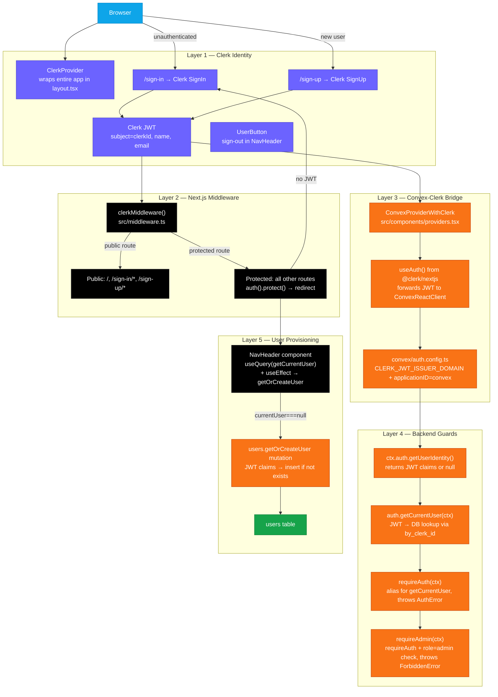
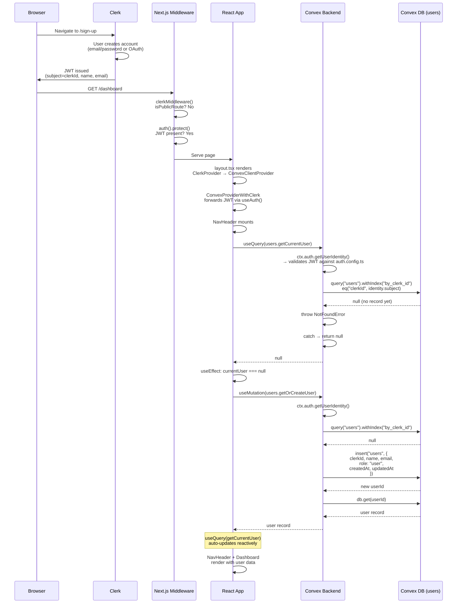
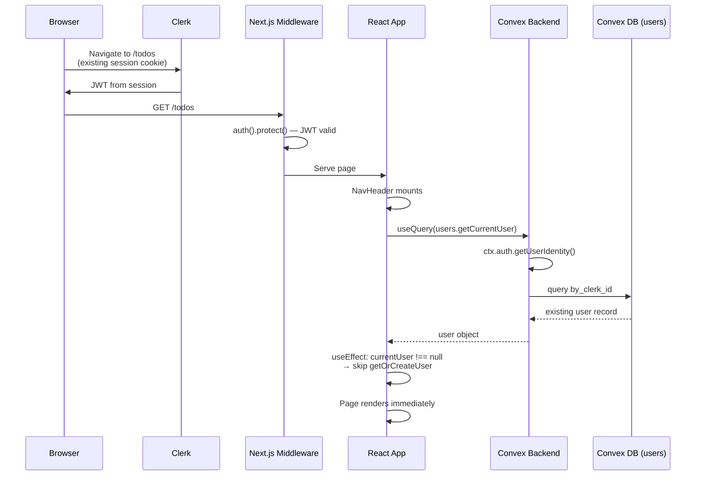
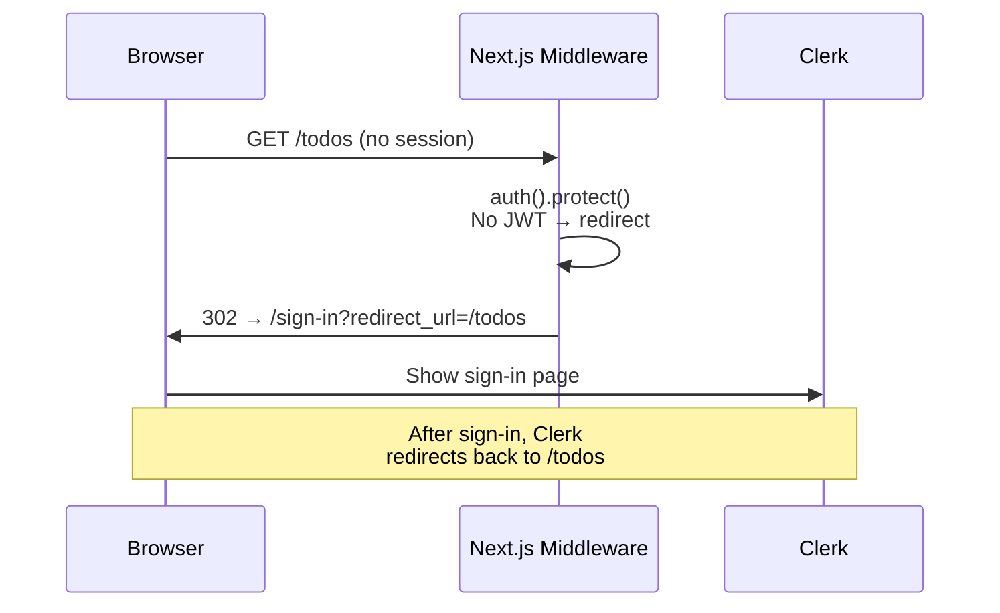
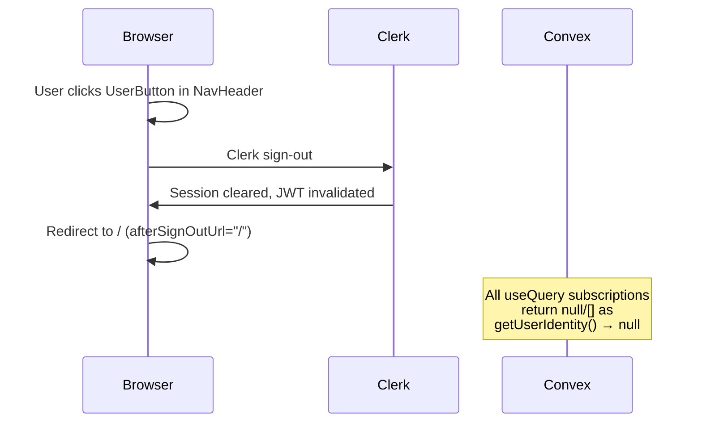
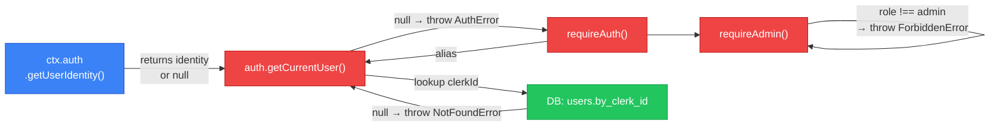

# Authentication Flow — Sequence Diagrams

## Architecture Overview

## First Visit — Full Sequence

## Returning Visit — Fast Path

## Unauthenticated Access Attempt

## Sign Out Flow

## Backend Auth Helper Call Chain

## Environment Variables

| Variable | Location | Used By |
|----------|----------|---------|
| `NEXT_PUBLIC_CLERK_PUBLISHABLE_KEY` | `.env.local` | Clerk frontend SDK |
| `CLERK_SECRET_KEY` | `.env.local` | Clerk server-side (middleware) |
| `CLERK_JWT_ISSUER_DOMAIN` | Convex dashboard env | `convex/auth.config.ts` |
| `NEXT_PUBLIC_CONVEX_URL` | `.env.local` | `ConvexReactClient` constructor |
