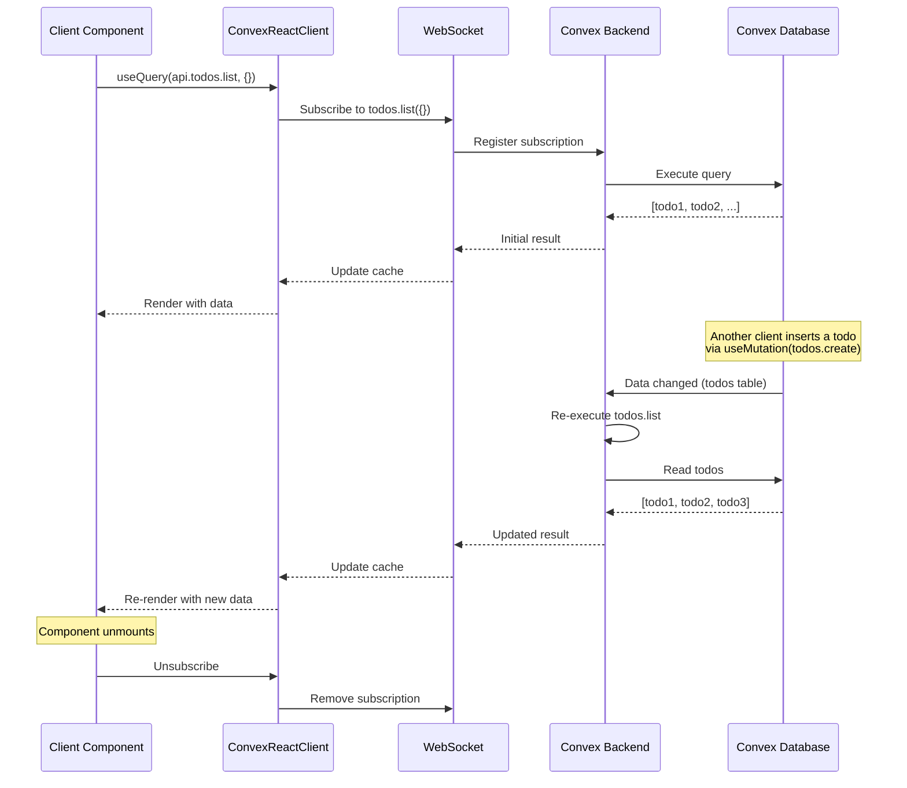
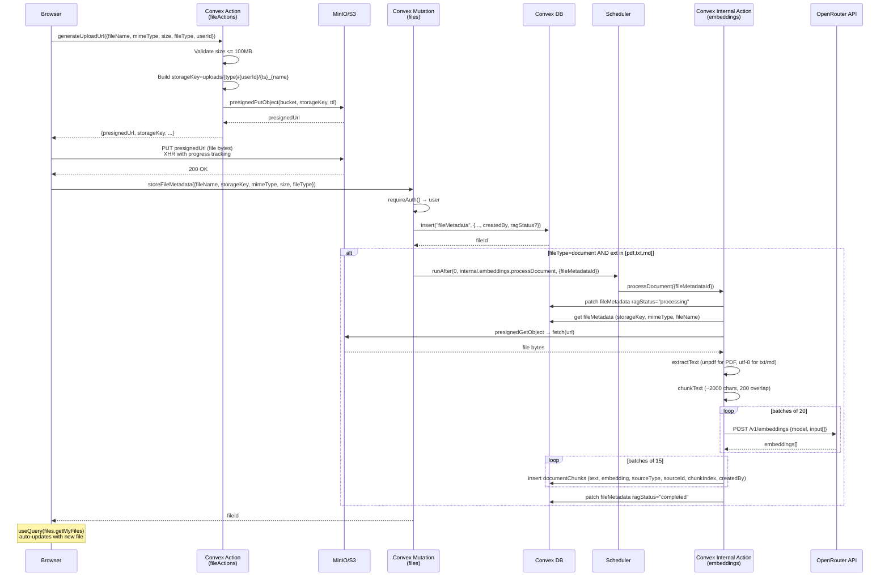
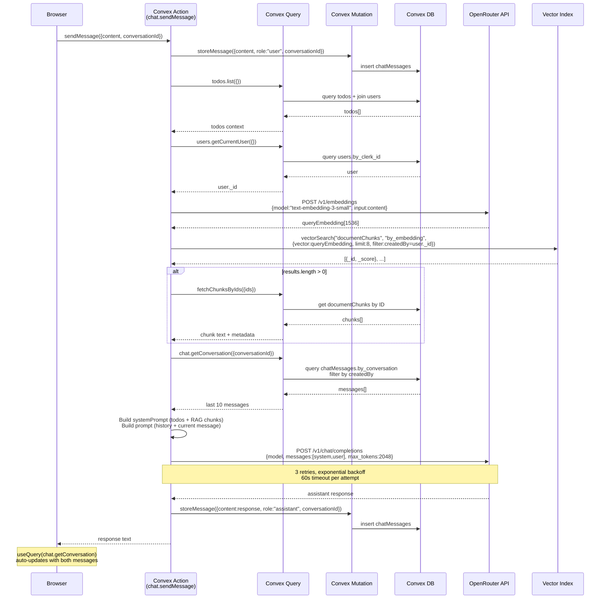
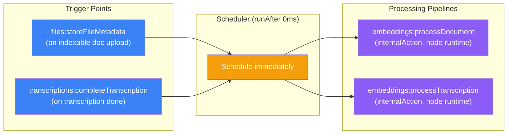

# Data Flow — Client ↔ Convex ↔ External Services

## Complete Data Flow Architecture

```mermaid
flowchart TB
    classDef client fill:#0EA5E9,color:#fff,stroke:#0284C7
    classDef provider fill:#6366F1,color:#fff,stroke:#4F46E5
    classDef query fill:#22C55E,color:#fff,stroke:#16A34A
    classDef mutation fill:#3B82F6,color:#fff,stroke:#2563EB
    classDef action fill:#F97316,color:#fff,stroke:#EA580C
    classDef internal fill:#8B5CF6,color:#fff,stroke:#7C3AED
    classDef db fill:#10B981,color:#fff,stroke:#059669
    classDef ext fill:#EC4899,color:#fff,stroke:#DB2777
    classDef helper fill:#A855F7,color:#fff,stroke:#9333EA

    subgraph Browser["Browser (Next.js Client)"]
        Pages["Pages: /dashboard, /todos,<br/>/uploads, /transcription, /chat"]:::client
        Components["Components: NavHeader,<br/>FileUpload"]:::client
        XHR["XHR Upload<br/>(direct to MinIO)"]:::client
    end

    subgraph Providers["Provider Layer"]
        Clerk["ClerkProvider<br/>JWT management"]:::provider
        ConvexProv["ConvexProviderWithClerk<br/>forwards JWT, manages subscriptions"]:::provider
    end

    subgraph ConvexRuntime["Convex Runtime"]
        subgraph PublicAPI["Public API (client-callable)"]
            Queries["Queries (reactive)<br/>users.getCurrentUser<br/>users.getAllUsers<br/>todos.list<br/>files.getMyFiles<br/>transcriptions.getTranscriptions<br/>chat.getConversations<br/>chat.getConversation"]:::query
            Mutations["Mutations (transactional)<br/>users.getOrCreateUser<br/>todos.create/update/updateStatus/remove<br/>files.storeFileMetadata/deleteFile<br/>transcriptions.queueTranscription<br/>chat.storeMessage/deleteConversation"]:::mutation
            Actions["Actions (side effects)<br/>fileActions.generateUploadUrl<br/>fileActions.generateDownloadUrl<br/>transcriptions.processTranscription<br/>chat.sendMessage<br/>llm.callLLM"]:::action
        end

        subgraph InternalAPI["Internal API (server-only)"]
            IntMutations["Internal Mutations<br/>documentChunks.storeChunks<br/>documentChunks.deleteChunksBySource<br/>documentChunks.updateFileRagStatus<br/>documentChunks.updateTranscriptionRagStatus<br/>transcriptions.completeTranscription<br/>transcriptions.failTranscription<br/>transcriptions._updateStatus"]:::internal
            IntQueries["Internal Queries<br/>documentChunks.fetchChunksByIds<br/>documentChunks.getFileMetadata<br/>transcriptions.getTranscription"]:::internal
            IntActions["Internal Actions<br/>embeddings.processDocument<br/>embeddings.processTranscription"]:::internal
        end

        subgraph Helpers["Shared Helpers (openrouter.ts)"]
            EmbedHelper["generateSingleEmbedding()<br/>embedBatch()"]:::helper
            LLMHelper["callLLMHelper()"]:::helper
        end

        subgraph Scheduler["Scheduler"]
            Sched["ctx.scheduler.runAfter(0, ...)"]:::internal
        end
    end

    subgraph Database["Convex Database"]
        UsersT["users"]:::db
        TodosT["todos"]:::db
        FilesT["fileMetadata"]:::db
        TransT["transcriptions"]:::db
        ChatT["chatMessages"]:::db
        ChunksT["documentChunks<br/>(+ vector index)"]:::db
    end

    subgraph External["External Services"]
        MinIO["MinIO / S3<br/>Object Storage"]:::ext
        NCAT["NCAT API<br/>Transcription"]:::ext
        OpenRouter["OpenRouter API<br/>Embeddings + LLM"]:::ext
    end

    %% Client → Providers
    Pages --> Clerk
    Components --> Clerk
    Clerk --> ConvexProv

    %% Client → Convex (hooks)
    ConvexProv -- "useQuery() →<br/>reactive subscription" --> Queries
    ConvexProv -- "useMutation() →<br/>one-shot call" --> Mutations
    ConvexProv -- "useAction() →<br/>one-shot call" --> Actions

    %% Queries → DB (read)
    Queries -- "read" --> UsersT
    Queries -- "read" --> TodosT
    Queries -- "read" --> FilesT
    Queries -- "read" --> TransT
    Queries -- "read" --> ChatT

    %% Mutations → DB (read/write)
    Mutations -- "read/write" --> UsersT
    Mutations -- "read/write" --> TodosT
    Mutations -- "read/write" --> FilesT
    Mutations -- "read/write" --> TransT
    Mutations -- "read/write" --> ChatT
    Mutations -- "read/delete" --> ChunksT

    %% Mutations → Scheduler
    Mutations -- "storeFileMetadata<br/>schedules processDocument" --> Sched
    Sched --> IntActions

    %% Internal Mutations → DB
    IntMutations -- "write/delete" --> ChunksT
    IntMutations -- "patch ragStatus" --> FilesT
    IntMutations -- "patch status/ragStatus" --> TransT

    %% Internal Queries → DB
    IntQueries -- "read" --> ChunksT
    IntQueries -- "read" --> FilesT
    IntQueries -- "read" --> TransT

    %% Internal Actions → Internal Mutations/Queries
    IntActions -- "runMutation/<br/>runQuery" --> IntMutations
    IntActions -- "runMutation/<br/>runQuery" --> IntQueries

    %% Actions → External Services
    Actions -- "presigned URLs" --> MinIO
    Actions -- "POST /v1/media/transcribe<br/>POST /v1/toolkit/job/status" --> NCAT
    Actions -- "import call" --> EmbedHelper
    Actions -- "import call" --> LLMHelper
    IntActions -- "presigned download" --> MinIO
    IntActions -- "import call" --> EmbedHelper
    EmbedHelper -- "POST /v1/embeddings" --> OpenRouter
    LLMHelper -- "POST /v1/chat/completions" --> OpenRouter

    %% Actions → Internal
    Actions -- "runMutation/<br/>runQuery" --> IntMutations
    Actions -- "runQuery" --> IntQueries
    Actions -- "vectorSearch" --> ChunksT

    %% Direct upload
    XHR -- "PUT presigned URL<br/>(file bytes)" --> MinIO

    %% DB → Client (reactive)
    UsersT -. "subscription<br/>auto-update" .-> ConvexProv
    TodosT -. "subscription<br/>auto-update" .-> ConvexProv
    FilesT -. "subscription<br/>auto-update" .-> ConvexProv
    TransT -. "subscription<br/>auto-update" .-> ConvexProv
    ChatT -. "subscription<br/>auto-update" .-> ConvexProv
```

## Reactive Subscription Flow

## File Upload Data Flow (Detailed)

## Chat RAG Data Flow (Detailed)

## Scheduler Pipeline Flow

## Runtime Boundaries

```mermaid
graph TB
    classDef default_rt fill:#22C55E,color:#fff,stroke:#16A34A
    classDef node_rt fill:#F97316,color:#fff,stroke:#EA580C
    classDef shared fill:#8B5CF6,color:#fff,stroke:#7C3AED

    subgraph default_runtime["Default Runtime (V8 isolate — no Node.js)"]
        auth_ts["auth.ts — helper functions"]:::default_rt
        users_ts["users.ts — queries + mutations"]:::default_rt
        todos_ts["todos.ts — queries + mutations"]:::default_rt
        files_ts["files.ts — queries + mutations"]:::default_rt
        transcriptions_ts["transcriptions.ts — queries + mutations + action"]:::default_rt
        documentChunks_ts["documentChunks.ts — internal queries + mutations"]:::default_rt
        chat_ts["chat.ts — queries + mutations + action"]:::default_rt
        llm_ts["llm.ts — action (delegates to helper)"]:::default_rt
    end

    subgraph node_runtime["Node.js Runtime ('use node')"]
        fileActions_ts["fileActions.ts — actions<br/>requires: minio"]:::node_rt
        embeddings_ts["embeddings.ts — internalActions<br/>requires: unpdf, minio"]:::node_rt
    end

    subgraph shared_helpers["Shared Helpers (no runtime directive — importable from both)"]
        openrouter_ts["openrouter.ts<br/>callEmbeddingAPI, generateSingleEmbedding,<br/>embedBatch, callLLMHelper<br/>(pure fetch, no Node.js deps)"]:::shared
        util_ts["util.ts<br/>error classes + utilities"]:::shared
    end

    chat_ts -- "import" --> openrouter_ts
    llm_ts -- "import" --> openrouter_ts
    embeddings_ts -- "import" --> openrouter_ts
```

