# Convex Functions — Complete Call Graph

## Function Registry

```mermaid
graph TB
    classDef pub_query fill:#22C55E,color:#fff,stroke:#16A34A
    classDef pub_mutation fill:#3B82F6,color:#fff,stroke:#2563EB
    classDef pub_action fill:#F97316,color:#fff,stroke:#EA580C
    classDef int_query fill:#22C55E,color:#fff,stroke:#16A34A,stroke-dasharray:5
    classDef int_mutation fill:#3B82F6,color:#fff,stroke:#2563EB,stroke-dasharray:5
    classDef int_action fill:#F97316,color:#fff,stroke:#EA580C,stroke-dasharray:5
    classDef helper fill:#8B5CF6,color:#fff,stroke:#7C3AED

    subgraph Legend
        direction LR
        LQ["Query (public)"]:::pub_query
        LM["Mutation (public)"]:::pub_mutation
        LA["Action (public)"]:::pub_action
        LIQ["Query (internal)"]:::int_query
        LIM["Mutation (internal)"]:::int_mutation
        LIA["Action (internal)"]:::int_action
        LH["Helper (import)"]:::helper
    end

    subgraph users_mod["users.ts"]
        u_getCurrent["getCurrentUser<br/>query"]:::pub_query
        u_getOrCreate["getOrCreateUser<br/>mutation"]:::pub_mutation
        u_getAll["getAllUsers<br/>query"]:::pub_query
    end

    subgraph todos_mod["todos.ts"]
        t_list["list<br/>query"]:::pub_query
        t_create["create<br/>mutation"]:::pub_mutation
        t_update["update<br/>mutation"]:::pub_mutation
        t_updateStatus["updateStatus<br/>mutation"]:::pub_mutation
        t_remove["remove<br/>mutation"]:::pub_mutation
    end

    subgraph files_mod["files.ts"]
        f_store["storeFileMetadata<br/>mutation"]:::pub_mutation
        f_getMyFiles["getMyFiles<br/>query"]:::pub_query
        f_delete["deleteFile<br/>mutation"]:::pub_mutation
    end

    subgraph fileActions_mod["fileActions.ts (use node)"]
        fa_upload["generateUploadUrl<br/>action"]:::pub_action
        fa_download["generateDownloadUrl<br/>action"]:::pub_action
    end

    subgraph transcriptions_mod["transcriptions.ts"]
        tr_queue["queueTranscription<br/>mutation"]:::pub_mutation
        tr_getAll["getTranscriptions<br/>query"]:::pub_query
        tr_getOne["getTranscription<br/>internalQuery"]:::int_query
        tr_process["processTranscription<br/>action"]:::pub_action
        tr_complete["completeTranscription<br/>internalMutation"]:::int_mutation
        tr_fail["failTranscription<br/>internalMutation"]:::int_mutation
        tr_status["_updateStatus<br/>internalMutation"]:::int_mutation
    end

    subgraph documentChunks_mod["documentChunks.ts"]
        dc_store["storeChunks<br/>internalMutation"]:::int_mutation
        dc_fetch["fetchChunksByIds<br/>internalQuery"]:::int_query
        dc_deleteSrc["deleteChunksBySource<br/>internalMutation"]:::int_mutation
        dc_fileRag["updateFileRagStatus<br/>internalMutation"]:::int_mutation
        dc_transRag["updateTranscriptionRagStatus<br/>internalMutation"]:::int_mutation
        dc_getMeta["getFileMetadata<br/>internalQuery"]:::int_query
    end

    subgraph embeddings_mod["embeddings.ts (use node)"]
        e_processDoc["processDocument<br/>internalAction"]:::int_action
        e_processTrans["processTranscription<br/>internalAction"]:::int_action
    end

    subgraph chat_mod["chat.ts"]
        c_getConvs["getConversations<br/>query"]:::pub_query
        c_getConv["getConversation<br/>query"]:::pub_query
        c_store["storeMessage<br/>mutation"]:::pub_mutation
        c_send["sendMessage<br/>action"]:::pub_action
        c_delete["deleteConversation<br/>mutation"]:::pub_mutation
    end

    subgraph llm_mod["llm.ts"]
        l_call["callLLM<br/>action"]:::pub_action
    end

    subgraph openrouter_mod["openrouter.ts (helpers)"]
        or_embed["callEmbeddingAPI"]:::helper
        or_single["generateSingleEmbedding"]:::helper
        or_batch["embedBatch"]:::helper
        or_llm["callLLMHelper"]:::helper
    end
```

## Inter-Function Call Graph (all edges)

```mermaid
flowchart TB
    classDef pub_query fill:#22C55E,color:#fff,stroke:#16A34A
    classDef pub_mutation fill:#3B82F6,color:#fff,stroke:#2563EB
    classDef pub_action fill:#F97316,color:#fff,stroke:#EA580C
    classDef int_query fill:#22C55E,color:#fff,stroke:#16A34A,stroke-dasharray:5
    classDef int_mutation fill:#3B82F6,color:#fff,stroke:#2563EB,stroke-dasharray:5
    classDef int_action fill:#F97316,color:#fff,stroke:#EA580C,stroke-dasharray:5
    classDef ext fill:#EC4899,color:#fff,stroke:#DB2777
    classDef helper fill:#8B5CF6,color:#fff,stroke:#7C3AED

    %% External services
    MinIO["MinIO / S3"]:::ext
    NCAT["NCAT API<br/>/v1/media/transcribe<br/>/v1/toolkit/job/status"]:::ext
    OpenRouter["OpenRouter API<br/>/v1/chat/completions<br/>/v1/embeddings"]:::ext
    VectorDB["ctx.vectorSearch<br/>documentChunks.by_embedding"]:::ext

    %% ===== DOCUMENT UPLOAD PIPELINE =====
    f_store["files:storeFileMetadata<br/>(mutation)"]:::pub_mutation
    e_processDoc["embeddings:processDocument<br/>(internalAction)"]:::int_action
    dc_fileRag["documentChunks:updateFileRagStatus<br/>(internalMutation)"]:::int_mutation
    dc_getMeta["documentChunks:getFileMetadata<br/>(internalQuery)"]:::int_query
    dc_store["documentChunks:storeChunks<br/>(internalMutation)"]:::int_mutation
    or_batch["openrouter:embedBatch<br/>(helper)"]:::helper

    f_store -- "scheduler.runAfter(0)<br/>if pdf/txt/md" --> e_processDoc
    e_processDoc -- "runMutation<br/>ragStatus=processing" --> dc_fileRag
    e_processDoc -- "runQuery" --> dc_getMeta
    e_processDoc -- "presignedGetObject" --> MinIO
    e_processDoc -- "fetch(downloadUrl)" --> MinIO
    e_processDoc -- "import call" --> or_batch
    or_batch -- "fetch" --> OpenRouter
    e_processDoc -- "runMutation<br/>batches of 15" --> dc_store
    e_processDoc -- "runMutation<br/>ragStatus=completed|failed" --> dc_fileRag

    %% ===== TRANSCRIPTION PIPELINE =====
    tr_process["transcriptions:processTranscription<br/>(action)"]:::pub_action
    tr_status["transcriptions:_updateStatus<br/>(internalMutation)"]:::int_mutation
    tr_complete["transcriptions:completeTranscription<br/>(internalMutation)"]:::int_mutation
    tr_fail["transcriptions:failTranscription<br/>(internalMutation)"]:::int_mutation
    e_processTrans["embeddings:processTranscription<br/>(internalAction)"]:::int_action
    dc_transRag["documentChunks:updateTranscriptionRagStatus<br/>(internalMutation)"]:::int_mutation
    tr_getOne["transcriptions:getTranscription<br/>(internalQuery)"]:::int_query

    tr_process -- "runMutation<br/>status=processing" --> tr_status
    tr_process -- "POST /v1/media/transcribe" --> NCAT
    tr_process -- "POST /v1/toolkit/job/status<br/>poll every 10s, max 30x" --> NCAT
    tr_process -- "runMutation<br/>(on success)" --> tr_complete
    tr_process -- "runMutation<br/>(on error or timeout)" --> tr_fail
    tr_process -- "runMutation<br/>(on code=200 direct)" --> tr_complete
    tr_complete -- "scheduler.runAfter(0)" --> e_processTrans
    e_processTrans -- "runMutation<br/>ragStatus=processing" --> dc_transRag
    e_processTrans -- "runQuery" --> tr_getOne
    e_processTrans -- "import call" --> or_batch
    e_processTrans -- "runMutation<br/>batches of 15" --> dc_store
    e_processTrans -- "runMutation<br/>ragStatus=completed|failed" --> dc_transRag

    %% ===== CHAT / RAG PIPELINE =====
    c_send["chat:sendMessage<br/>(action)"]:::pub_action
    c_store["chat:storeMessage<br/>(mutation)"]:::pub_mutation
    t_list["todos:list<br/>(query)"]:::pub_query
    u_getCurrent["users:getCurrentUser<br/>(query)"]:::pub_query
    dc_fetch["documentChunks:fetchChunksByIds<br/>(internalQuery)"]:::int_query
    c_getConv["chat:getConversation<br/>(query)"]:::pub_query
    or_single["openrouter:generateSingleEmbedding<br/>(helper)"]:::helper
    or_llm["openrouter:callLLMHelper<br/>(helper)"]:::helper

    c_send -- "runMutation<br/>role=user" --> c_store
    c_send -- "runQuery<br/>todos for context" --> t_list
    c_send -- "runQuery<br/>get user for vector filter" --> u_getCurrent
    c_send -- "import call<br/>embed query text" --> or_single
    or_single -- "fetch" --> OpenRouter
    c_send -- "vectorSearch<br/>limit=8, filter=createdBy" --> VectorDB
    c_send -- "runQuery<br/>fetch chunk text" --> dc_fetch
    c_send -- "runQuery<br/>last 10 messages" --> c_getConv
    c_send -- "import call<br/>3 retries, 60s timeout" --> or_llm
    or_llm -- "fetch" --> OpenRouter
    c_send -- "runMutation<br/>role=assistant" --> c_store

    %% ===== FILE ACTIONS (MinIO) =====
    fa_upload["fileActions:generateUploadUrl<br/>(action, node)"]:::pub_action
    fa_download["fileActions:generateDownloadUrl<br/>(action, node)"]:::pub_action
    fa_upload -- "presignedPutObject<br/>100MB max, TTL from env" --> MinIO
    fa_download -- "presignedGetObject<br/>TTL from env" --> MinIO

    %% ===== FILE DELETE =====
    f_delete["files:deleteFile<br/>(mutation)"]:::pub_mutation
    f_delete -- "query by_source + delete<br/>all matching chunks" --> dc_store

    %% ===== LLM WRAPPER =====
    l_call["llm:callLLM<br/>(action)"]:::pub_action
    l_call -- "import call" --> or_llm
```

## Table Access Matrix

Shows which functions read (R) or write (W) each table.

| Function | Type | users | todos | fileMetadata | transcriptions | chatMessages | documentChunks |
|----------|------|-------|-------|-------------|----------------|-------------|----------------|
| `users.getCurrentUser` | query | R | | | | | |
| `users.getOrCreateUser` | mutation | R/W | | | | | |
| `users.getAllUsers` | query | R | | | | | |
| `todos.list` | query | R | R | | | | |
| `todos.create` | mutation | R | W | | | | |
| `todos.update` | mutation | R | R/W | | | | |
| `todos.updateStatus` | mutation | R | R/W | | | | |
| `todos.remove` | mutation | R | R/D | | | | |
| `files.storeFileMetadata` | mutation | R | | W | | | |
| `files.getMyFiles` | query | R | | R | | | |
| `files.deleteFile` | mutation | R | | R/D | | | D |
| `fileActions.generateUploadUrl` | action | | | | | | |
| `fileActions.generateDownloadUrl` | action | | | | | | |
| `transcriptions.queueTranscription` | mutation | R | | R | R/W | | |
| `transcriptions.getTranscriptions` | query | R | | R | R | | |
| `transcriptions.getTranscription` | intQuery | | | | R | | |
| `transcriptions.processTranscription` | action | | | | (via int) | | |
| `transcriptions.completeTranscription` | intMut | | | | W | | |
| `transcriptions.failTranscription` | intMut | | | | W | | |
| `transcriptions._updateStatus` | intMut | | | | W | | |
| `documentChunks.storeChunks` | intMut | | | | | | W |
| `documentChunks.fetchChunksByIds` | intQuery | | | | | | R |
| `documentChunks.deleteChunksBySource` | intMut | | | | | | R/D |
| `documentChunks.updateFileRagStatus` | intMut | | | W | | | |
| `documentChunks.updateTranscriptionRagStatus` | intMut | | | | W | | |
| `documentChunks.getFileMetadata` | intQuery | | | R | | | |
| `embeddings.processDocument` | intAction | | | (via int) | | | (via int) |
| `embeddings.processTranscription` | intAction | | | | (via int) | | (via int) |
| `chat.getConversations` | query | R | | | | R | |
| `chat.getConversation` | query | R | | | | R | |
| `chat.storeMessage` | mutation | R | | | | W | |
| `chat.sendMessage` | action | (via query) | (via query) | | | (via mut) | (via int+vec) |
| `chat.deleteConversation` | mutation | R | | | | R/D | |
| `llm.callLLM` | action | | | | | | |

## Auth Guards

| Function | Guard | Ownership Check |
|----------|-------|----------------|
| `users.getCurrentUser` | try/catch getCurrentUser, returns null | N/A |
| `users.getOrCreateUser` | ctx.auth.getUserIdentity() | N/A |
| `users.getAllUsers` | try/catch getCurrentUser, returns [] | N/A |
| `todos.list` | requireAuth (try/catch, returns []) | None (returns all todos) |
| `todos.create` | requireAuth | Sets createdBy=user |
| `todos.update` | requireAuth | createdBy OR assignedTo must match |
| `todos.updateStatus` | requireAuth | createdBy OR assignedTo must match |
| `todos.remove` | requireAuth | createdBy must match (creator only) |
| `files.storeFileMetadata` | requireAuth | Sets createdBy=user |
| `files.getMyFiles` | requireAuth (try/catch, returns []) | Filters by createdBy |
| `files.deleteFile` | requireAuth | createdBy must match |
| `transcriptions.queueTranscription` | requireAuth | Verifies file exists + is audio |
| `transcriptions.getTranscriptions` | requireAuth (try/catch, returns []) | Filters by createdBy |
| `chat.getConversations` | requireAuth (try/catch, returns []) | Filters by createdBy |
| `chat.getConversation` | requireAuth (try/catch, returns []) | Filters messages by createdBy |
| `chat.storeMessage` | requireAuth | Sets createdBy=user |
| `chat.deleteConversation` | requireAuth | Only deletes own messages |
| All internal functions | N/A — not client-callable | N/A |
