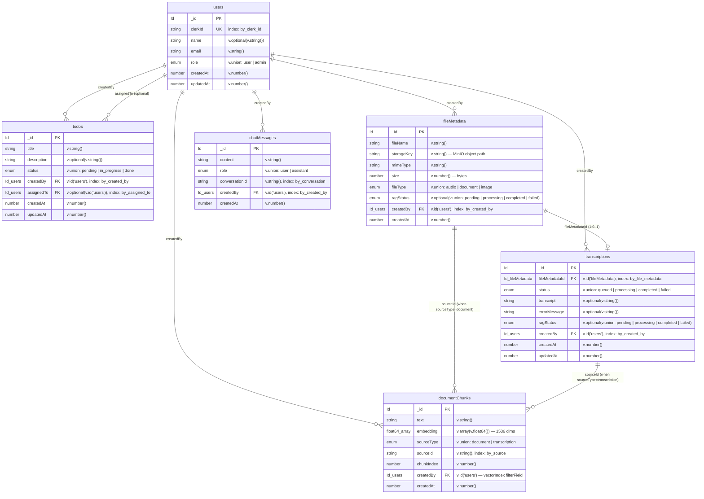

# Database Schema — Entity Relationship Diagram

## Full ER Diagram

## Indexes

## Field-Level Detail

| Table | Field | Convex Type | Required | Notes |
|-------|-------|-------------|----------|-------|
| **users** | `_id` | `Id<"users">` | auto | System-generated |
| | `clerkId` | `v.string()` | yes | Clerk `identity.subject`, unique via index |
| | `name` | `v.optional(v.string())` | no | From Clerk JWT `identity.name` |
| | `email` | `v.string()` | yes | From Clerk JWT `identity.email`, defaults to `""` |
| | `role` | `v.union(v.literal("user"), v.literal("admin"))` | yes | Defaults to `"user"` on creation |
| | `createdAt` | `v.number()` | yes | `Date.now()` |
| | `updatedAt` | `v.number()` | yes | `Date.now()` |
| **todos** | `_id` | `Id<"todos">` | auto | |
| | `title` | `v.string()` | yes | |
| | `description` | `v.optional(v.string())` | no | |
| | `status` | `v.union(...)` | yes | `pending` (default) / `in_progress` / `done` |
| | `createdBy` | `v.id("users")` | yes | FK to users, ownership check on mutations |
| | `assignedTo` | `v.optional(v.id("users"))` | no | FK to users, grants update permission |
| | `createdAt` | `v.number()` | yes | |
| | `updatedAt` | `v.number()` | yes | |
| **fileMetadata** | `_id` | `Id<"fileMetadata">` | auto | |
| | `fileName` | `v.string()` | yes | Original filename |
| | `storageKey` | `v.string()` | yes | MinIO path: `uploads/{fileType}/{userId}/{ts}_{name}` |
| | `mimeType` | `v.string()` | yes | |
| | `size` | `v.number()` | yes | Bytes, max 100MB enforced client-side |
| | `fileType` | `v.union(...)` | yes | `audio` / `document` / `image` |
| | `ragStatus` | `v.optional(v.union(...))` | no | Only set for indexable docs (pdf/txt/md) |
| | `createdBy` | `v.id("users")` | yes | FK to users, ownership check on delete |
| | `createdAt` | `v.number()` | yes | |
| **transcriptions** | `_id` | `Id<"transcriptions">` | auto | |
| | `fileMetadataId` | `v.id("fileMetadata")` | yes | 1:1 relationship, checked for duplicates |
| | `status` | `v.union(...)` | yes | `queued` → `processing` → `completed` or `failed` |
| | `transcript` | `v.optional(v.string())` | no | Set on completion by NCAT |
| | `errorMessage` | `v.optional(v.string())` | no | Set on failure |
| | `ragStatus` | `v.optional(v.union(...))` | no | Set to `pending` on completion, then processed |
| | `createdBy` | `v.id("users")` | yes | FK to users |
| | `createdAt` | `v.number()` | yes | |
| | `updatedAt` | `v.number()` | yes | |
| **chatMessages** | `_id` | `Id<"chatMessages">` | auto | |
| | `content` | `v.string()` | yes | Message text |
| | `role` | `v.union(...)` | yes | `user` or `assistant` |
| | `conversationId` | `v.string()` | yes | Client-generated: `conv_{Date.now()}` |
| | `createdBy` | `v.id("users")` | yes | FK to users, ownership filter on queries |
| | `createdAt` | `v.number()` | yes | |
| **documentChunks** | `_id` | `Id<"documentChunks">` | auto | |
| | `text` | `v.string()` | yes | ~2000 chars per chunk |
| | `embedding` | `v.array(v.float64())` | yes | 1536-dimensional, text-embedding-3-small |
| | `sourceType` | `v.union(...)` | yes | `document` or `transcription` |
| | `sourceId` | `v.string()` | yes | fileMetadata._id or transcriptions._id as string |
| | `chunkIndex` | `v.number()` | yes | 0-indexed position within source |
| | `createdBy` | `v.id("users")` | yes | Copied from source, used as vector filter |
| | `createdAt` | `v.number()` | yes | |
