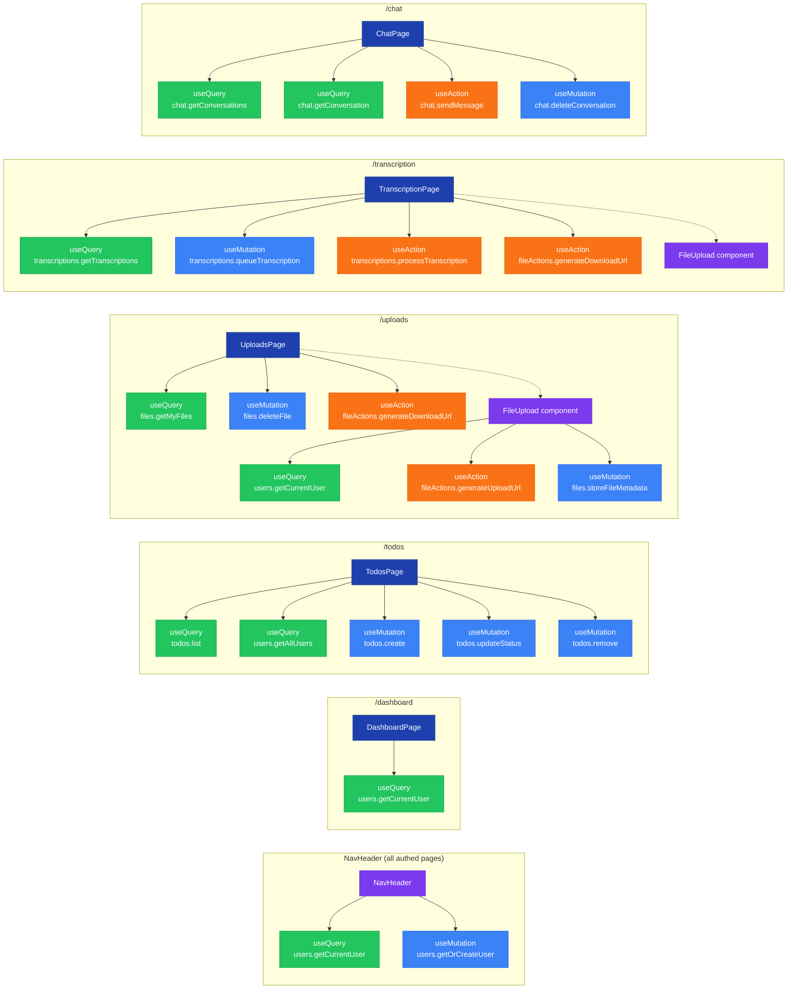
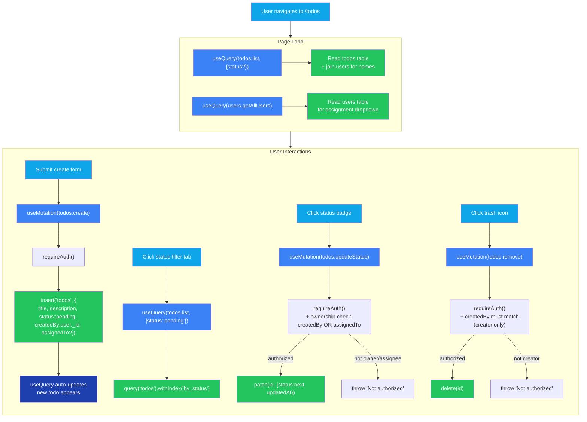
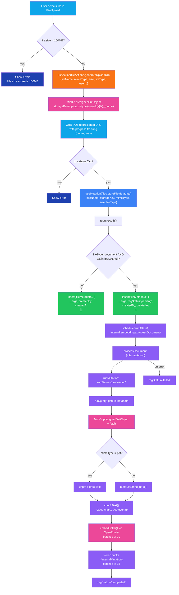
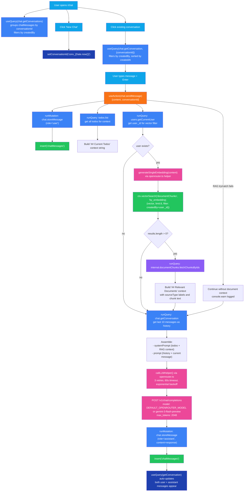
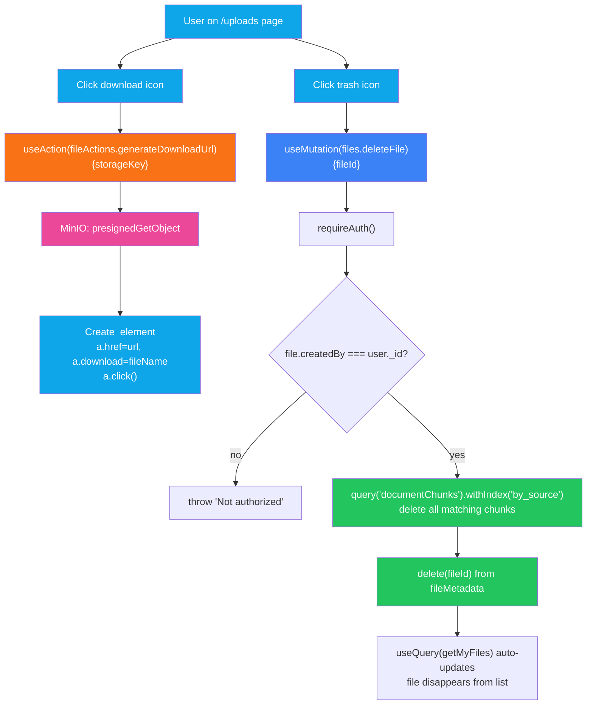

# User Journeys — Page-to-Function Flowcharts

## Page → Convex Function Map

## Journey 1: Todo Management

## Journey 2: File Upload + RAG Indexing

## Journey 3: Audio Transcription + RAG

```mermaid
flowchart TB
    classDef user fill:#0EA5E9,color:#fff
    classDef fn fill:#3B82F6,color:#fff
    classDef action fill:#F97316,color:#fff
    classDef db fill:#22C55E,color:#fff
    classDef ext fill:#EC4899,color:#fff
    classDef internal fill:#8B5CF6,color:#fff

    Start["User uploads audio via FileUpload"]:::user
    Start --> Upload["Same upload flow as Journey 2<br/>(fileType='audio', no RAG scheduled)"]:::action

    Upload --> SaveIds["onUploadComplete callback<br/>saves fileId + storageKey in state"]:::user

    SaveIds --> Click["User clicks 'Start Transcription'"]:::user

    Click --> Queue["useMutation(transcriptions.queueTranscription)<br/>{fileMetadataId}"]:::fn
    Queue --> QAuth["requireAuth()"]
    QAuth --> QCheck1{"file exists AND<br/>fileType === 'audio'?"}
    QCheck1 -- no --> QErr["throw error"]
    QCheck1 -- yes --> QCheck2{"transcription already exists<br/>for this fileMetadataId?"}
    QCheck2 -- yes --> QReturn["return existing._id"]
    QCheck2 -- no --> QInsert["insert('transcriptions', {<br/>status:'queued', createdBy, ...})"]:::db
    QInsert --> QDone["return transcriptionId"]

    QDone --> GetAudio["useAction(fileActions.generateDownloadUrl)<br/>{storageKey}"]:::action
    GetAudio --> MinIO["MinIO: presignedGetObject"]:::ext
    MinIO --> Process

    Process["useAction(transcriptions.processTranscription)<br/>{transcriptionId, audioUrl}"]:::action

    Process --> P1["runMutation: _updateStatus → 'processing'"]:::internal
    P1 --> P2["POST /v1/media/transcribe<br/>{media_url, language:'en', include_text:true}<br/>header: x-api-key"]:::ext

    P2 --> P2Check{"response.code === 200<br/>AND response.text?"}
    P2Check -- "yes (direct result)" --> P_Complete
    P2Check -- "no (queued)" --> P3

    P3["Extract job_id from response"]
    P3 --> P3Check{"job_id exists?"}
    P3Check -- no --> P_Fail

    P3Check -- yes --> Poll["Poll loop: max 30 iterations, 10s interval"]
    Poll --> PollReq["POST /v1/toolkit/job/status<br/>{job_id}<br/>header: x-api-key"]:::ext
    PollReq --> PollCheck{"job_status?"}
    PollCheck -- "'done' or 'completed'" --> P_Complete
    PollCheck -- "'failed' or 'error'" --> P_Fail
    PollCheck -- "'processing'" --> PollWait["await 10s"]
    PollWait --> Poll
    PollCheck -- "30 iterations exhausted" --> P_Timeout["throw 'Transcription timed out'"]
    P_Timeout --> P_Fail

    P_Complete["runMutation: completeTranscription<br/>{id, transcript}"]:::internal
    P_Complete --> CompletePatch["patch: status='completed',<br/>transcript=text,<br/>ragStatus='pending'"]:::db
    CompletePatch --> ScheduleRAG["scheduler.runAfter(0,<br/>internal.embeddings.processTranscription)"]:::internal
    ScheduleRAG --> RAG["Same chunk → embed → store pipeline<br/>as document RAG (Journey 2)"]:::internal

    P_Fail["runMutation: failTranscription<br/>{id, errorMessage}"]:::internal
    P_Fail --> FailPatch["patch: status='failed',<br/>errorMessage=msg"]:::db
```

## Journey 4: RAG Chat

## Journey 5: File Download + Delete

